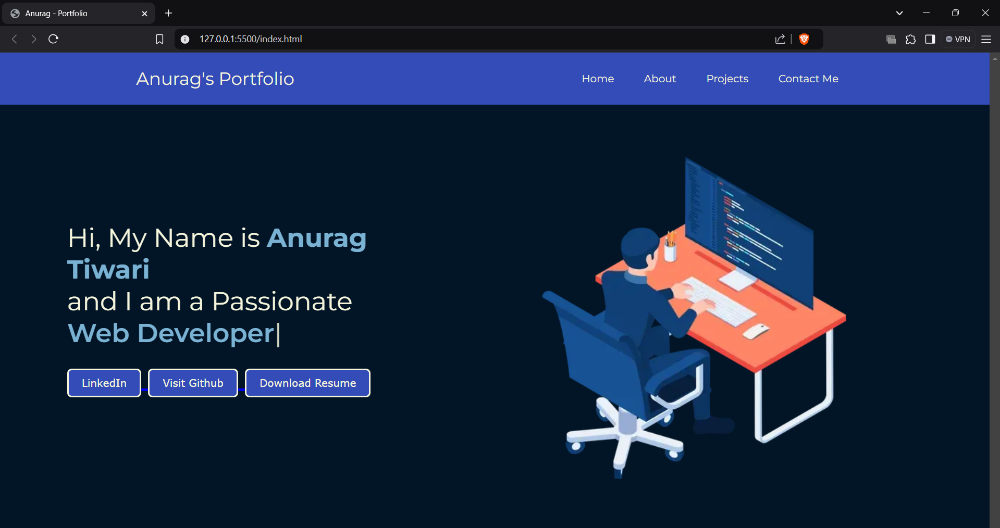

# Portfolio Website Project

**Name**: Anurag Ganesh Tiwari

**Company**: CODTECH IT SOLUTIONS PVT.LTD

**ID**: CT08DQL

**Domain**: Frontend Web Development

**Duration**: Dec 12th 2024 to Jan 12th 2025

**Mentor**: [Mentor Name]

## Overview of the Project

**Project**: Personal Portfolio Webpage  

## Objective

The goal of this project is to create a visually appealing and responsive personal portfolio website to showcase my skills, projects, achievements, and contact information. The website will serve as a professional online presence for potential employers, clients, or collaborators.

## Key Features

- **About Me Section**: A brief introduction with my background, skills, and objectives.
- **Projects Gallery**: Display of key projects with details, images, and links to the live versions or GitHub repositories.
- **Skills Section**: A list of technical and soft skills with a visual representation of proficiency levels.
- **Contact Form**: A form for visitors to get in touch with me through email.
- **Responsive Design**: Mobile-friendly layout that adapts to various screen sizes.
- **Smooth Animations**: Subtle animations for a modern, interactive user experience.
- **Navigation Bar**: Sticky navigation bar for easy access to different sections of the website.

## Technologies Used

- **HTML5**: Semantically structured content and layout.
- **CSS3**: Styling and responsive design.
  - Flexbox and Grid for layout structure.
  - Google Fonts integration for typography.
  - CSS transitions and animations for smooth interactions.
- **JavaScript**: For interactive features.
  - Smooth scroll navigation.
  - Dynamic content loading (such as project details).
- **Libraries/Frameworks**:
  - Bootstrap for responsive grid system and components.
  - Font Awesome for icons (e.g., social media links).
  - jQuery for DOM manipulation (optional).

## Implementation Details

1. **User Interface**:
   - Clean and professional design.
   - A hero section with a brief introduction and call-to-action button.
   - A well-organized layout for showcasing my projects, skills, and contact information.
   - Custom-designed buttons and icons for navigation and social media links.

2. **Projects Gallery**:
   - Display of projects in a grid format.
   - Each project includes a title, description, image, and links to the live demo or GitHub repository.
   - Hover effects on project cards to highlight key details.

3. **Skills Section**:
   - Visual representation of technical skills using progress bars or circular skill meters.
   - Soft skills represented with icons or text to highlight communication and collaboration abilities.

4. **Contact Form**:
   - A contact form to allow visitors to get in touch with me.
   - Form validation to ensure all fields are filled correctly.
   - Simple UI for entering name, email, and message.

5. **Responsive Design**:
   - Layout adapts seamlessly to different screen sizes using media queries.
   - Flexbox and CSS Grid ensure proper alignment and structure across devices.

## Future Enhancements

- **Blog Section**: A section where I can share my thoughts, tutorials, or technical articles.
- **Downloadable Resume**: Option for visitors to download my resume as a PDF.
- **Animation Enhancements**: More interactive animations, such as scroll-based animations or parallax effects.
- **Testimonials Section**: Showcase feedback or testimonials from colleagues or project collaborators.
- **Light/Dark Mode**: Allow users to toggle between light and dark modes for better accessibility.
- **Portfolio Updates**: Regular updates to showcase new projects and skills.
- **Social Media Integration**: Automatically link or display content from my social media profiles (LinkedIn, GitHub, etc.).

